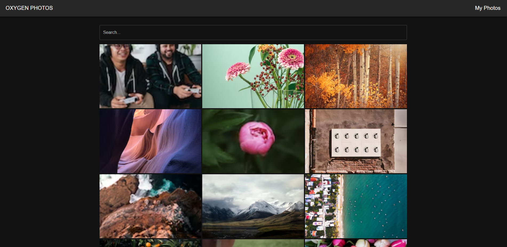

# OXYGEN PHOTOS

This project was bootstrapped with [Create React App](https://github.com/facebook/create-react-app), using the [Redux](https://redux.js.org/) and [Redux Toolkit](https://redux-toolkit.js.org/) template.

### Preview

[https://unodecopas.github.io/oxygen-react-photos/](https://unodecopas.github.io/oxygen-react-photos/)

## SCREENSHOT

## FEATURES

### SEARCH PAGE

- Get random photos
- Get photos by search Term
- Modal display selected photo properties
- Save photo in your FAVORITES (and localStorage)
- Download photo

### MY PHOTOS

- Get your favorites photos saved in localStorage
- Edit the description
- You can order by:
  - Width
  - Height
  - Likes
  - Dates
- Remove photos from favorites
